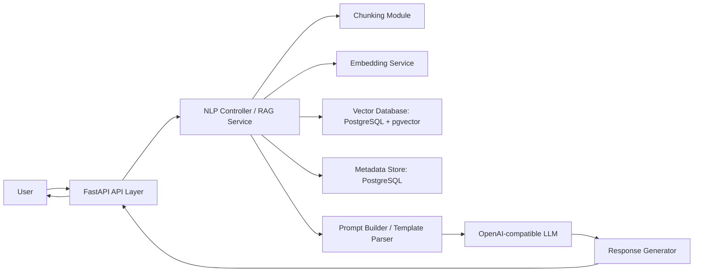
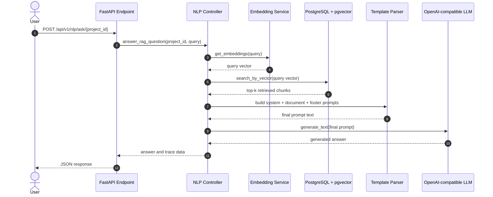

# Technical Documentation of the Retrieval-Augmented Generation System

## 1. Overview

Retrieval-Augmented Generation (RAG) is a system architecture that combines information retrieval with natural language generation. Instead of asking a large language model (LLM) to answer a question only from its parametric memory, the system first retrieves relevant external knowledge and then supplies that knowledge to the LLM as context. This design improves factual grounding, reduces hallucinations, and makes the answer process more transparent.

The motivation for using RAG is practical. A standalone LLM can generate fluent text, but it does not guarantee that the answer is current, domain-specific, or traceable to a trusted source. In a university project, this limitation is important because users often expect answers about specific records, documents, or domain data. RAG addresses this by separating knowledge storage from language generation. The retriever selects relevant evidence, and the generator produces a response constrained by that evidence.

### Problems solved by RAG

| Problem | How RAG addresses it |
|---|---|
| Hallucinated answers | The LLM receives grounded context from retrieved documents. |
| Outdated model knowledge | Knowledge can be updated in the vector store without retraining the model. |
| Weak domain specificity | Retrieval focuses the model on project-specific content. |
| Limited traceability | Retrieved chunks and metadata can be logged and inspected. |
| Large knowledge bases | Only the most relevant chunks are passed to the LLM. |

### Advantages

- Better factual grounding than prompt-only generation.
- Easier updates because new data can be indexed independently of the model.
- More suitable for private or local datasets.
- Supports traceability through chunk metadata and stored sources.

### Limitations

- Quality depends on retrieval quality and chunk design.
- If relevant information is not indexed, the model cannot recover it.
- The system still depends on the LLM for natural-language generation.
- Approximate vector search may miss some relevant documents.

### Real-world applications

- Domain chatbots for tourism, healthcare, law, and enterprise support.
- Internal knowledge assistants over company documents.
- Customer service systems that answer from policy and product documentation.
- Research assistants that summarize retrieved papers or reports.
- Recommendation and planning systems that use structured local data.

## 2. System Architecture

The implemented system follows a layered architecture built around a FastAPI application. The API layer exposes endpoints for indexing project data and answering questions. The NLP service coordinates chunking, embedding, retrieval, and prompt construction. The vector store uses PostgreSQL with pgvector for similarity search, while the relational database stores projects, assets, and chunk metadata.

### High-level architecture

### Component responsibilities

| Component | Responsibility |
|---|---|
| API Layer | Exposes REST endpoints for indexing and query answering. |
| RAG Service | Orchestrates the full retrieval and generation pipeline. |
| Embedding Service | Converts text into dense vectors for documents and queries. |
| Chunking Module | Splits long text into overlapping chunks for indexing. |
| Vector Database | Stores embeddings and performs similarity search. |
| Metadata Store | Stores projects, assets, and chunk records in relational form. |
| Prompt Builder | Assembles system instructions and retrieved context into a final prompt. |
| LLM | Generates the final answer from the constructed prompt. |
| Response Generator | Returns the answer and supporting trace data to the API caller. |
| Logging Module | Records operational events and prompt execution details. |
| Monitoring Module | Not explicitly implemented as a dedicated subsystem in the current codebase. |
| Configuration Module | Loads environment-based settings such as models, database credentials, and file limits. |

### Request flow

1. The user sends a question to the FastAPI endpoint `/api/v1/nlp/ask/{project_id}`.
2. The controller creates an NLP service instance using the configured clients.
3. The service ensures that the project exists in the metadata store.
4. The query text is embedded with the configured embedding model.
5. The query vector is sent to the pgvector-backed collection.
6. The vector database returns the top matching chunks with similarity scores.
7. The prompt builder inserts the retrieved chunks into a structured template.
8. The LLM receives the system prompt and the context prompt.
9. The model generates the answer.
10. The API returns the answer to the client.

### Sequence of operations

## 3. Detailed RAG Workflow

### 3.1 Document Ingestion

The ingestion layer is implemented through the file processing and map-data indexing workflow. The current codebase supports the following document formats for ingestion: JSON, PDF, TXT, MD, and CSV. JSON files are parsed into Python objects, text files are read directly with UTF-8 encoding, CSV files are loaded through `DictReader`, and PDF files are extracted page by page using a PDF parser imported at runtime.

Validation is limited to file-type filtering and basic parsing checks. The system rejects unsupported extensions and skips files that cannot be parsed. In a production-grade implementation, stronger validation would normally include schema checks, MIME-type validation, and content-size enforcement.

The system stores ingested content in two places:

| Storage target | Purpose |
|---|---|
| Relational database | Keeps chunk records, project records, and asset metadata. |
| Vector database | Stores chunk text, embeddings, metadata, and chunk identifiers for similarity search. |

For the current project-specific data flow, places and vendor profiles are read from PostgreSQL, converted into document text, then chunked and indexed.

### 3.2 Text Preprocessing

The preprocessing implemented in the codebase is intentionally simple. Text is stripped of leading and trailing whitespace, converted to a safe string representation, and truncated where a maximum character limit is configured. The system also reads and writes text using UTF-8 encoding and uses `ensure_ascii=False` when serializing JSON metadata so that Arabic and other Unicode text are preserved.

The following operations are effectively present:

- Whitespace trimming.
- Character-length limiting.
- UTF-8 handling.
- Preservation of Unicode content in JSON metadata.

The following operations are not explicitly implemented as a separate NLP pipeline:

- Advanced normalization.
- Lemmatization or stemming.
- Sentence segmentation.
- Tokenization beyond whitespace splitting.

Even with a simple pipeline, preprocessing improves retrieval quality because it reduces noise, avoids empty chunks, and keeps the text within model and storage limits.

### 3.3 Chunking Strategy

Chunking is required because LLMs and embedding models have context limits. Long documents must therefore be split into smaller units so that each unit can be embedded, stored, and retrieved independently. The codebase uses a word-based sliding window with overlap.

The implemented strategy works as follows:

1. Split the text by whitespace into words.
2. If the text is short enough, keep it as one chunk.
3. Otherwise, create chunks of fixed word count.
4. Advance by `chunk_size - overlap_size` words on each step.
5. Keep a limited overlap to preserve context continuity.

| Parameter | Role |
|---|---|
| Chunk size | Maximum number of words per chunk. |
| Overlap | Shared words between consecutive chunks. |
| Sliding window | Moves through the text by a fixed step. |

#### Trade-offs

| Large chunks | Small chunks |
|---|---|
| Better context preservation | Higher retrieval precision for narrow queries |
| Fewer embeddings and fewer records | More embeddings and more storage overhead |
| Can dilute the semantic focus | Can fragment meaning and lose context |
| May exceed model limits sooner | Easier to rank and retrieve efficiently |

The chosen overlap-based sliding window is a reasonable compromise for RAG because it preserves local continuity while keeping chunk size manageable.

### 3.4 Embedding Generation

The system uses an OpenAI-compatible embedding client. In the current configuration, the embedding backend is set through environment variables and the embedding dimensionality is configured as 384 in the project settings. The embedding service converts a text chunk or query into a dense vector that captures semantic similarity.

Embeddings outperform keyword search in this project because they can match related meanings even when the exact words differ. For example, a query about a tourist attraction can still retrieve content that uses different wording but describes the same place or concept.

The similarity model is based on cosine-style comparison in the pgvector layer, which is suitable for measuring directional similarity between semantic vectors.

### 3.5 Vector Database

The vector database is implemented using PostgreSQL with the pgvector extension. Each collection is stored as a PostgreSQL table containing:

- the chunk text,
- the vector embedding,
- JSON metadata,
- the related chunk identifier.

The system creates a vector index only after the collection reaches a configured threshold. The active index type in the code is HNSW, while IVFFLAT is defined in the enumeration but not the default in the implemented flow.

#### Vector database responsibilities

- Persist embeddings and chunk text.
- Support similarity search over dense vectors.
- Keep metadata in JSONB for filtering and traceability.
- Create an ANN index for more efficient retrieval.

#### Algorithms actually used

- Approximate nearest neighbor search.
- HNSW indexing.
- Cosine-based scoring through pgvector operators.

The project does not currently implement FAISS, IVF, product quantization, or BM25-based retrieval.

### 3.6 Retrieval Process

The retrieval pipeline is implemented in a straightforward sequence:

1. Receive the user query.
2. Truncate or normalize the query to the configured maximum length.
3. Convert the query to an embedding vector.
4. Search the project’s vector collection.
5. Rank documents by similarity score.
6. Return the top-K chunks.

The vector database computes the score as `1 - distance`, so higher values represent more similar chunks. The retrieved chunks are then passed to the prompt builder.

### 3.7 Reranking

Reranking is not implemented as a separate stage in the current codebase. There is no cross-encoder reranker, BM25 hybrid retrieval layer, or dense-sparse fusion module. The system currently relies on vector similarity search alone.

This design is simpler and easier to maintain for a graduation project, but it can be extended later if higher retrieval precision is required.

### 3.8 Prompt Engineering

Prompt construction is handled by a template parser that loads language-specific prompt files. The current English template instructs the LLM to answer only from the supplied context, remain language-consistent with the user, and produce structured itinerary output when required.

The final prompt has three parts:

- System prompt: defines behavior, grounding rules, and output constraints.
- Document prompt: inserts each retrieved chunk with source metadata.
- Footer prompt: adds the user query and task instructions.

#### Why this reduces hallucinations

- The model is instructed to use only retrieved evidence.
- Source metadata makes the context explicit.
- The response structure is constrained by the prompt.
- The system can refuse to invent information when the context is insufficient.

### 3.9 Response Generation

The response is generated through an OpenAI-compatible chat completion API. The code supports configuration of:

- temperature,
- maximum output tokens,
- input truncation,
- model identifier.

The current generation flow uses a system message plus the constructed RAG prompt. The generation client then returns the final answer text. This makes the generation stage deterministic enough for structured project use while still allowing fluent natural-language output.

## 4. Algorithms Used

Only the algorithms actually implemented in the codebase are documented below.

### 4.1 Whitespace Tokenization

**Purpose:** Split text into word units for chunking.

**Input:** Raw text string.

**Output:** List of words.

**Workflow:**

1. Trim the text.
2. Split on whitespace.
3. Use the resulting list as the basis for chunking.

**Complexity:** Time $O(n)$, space $O(n)$, where $n$ is the number of words.

**Advantages:** Simple, fast, and easy to maintain.

**Limitations:** Does not preserve linguistic structure beyond word boundaries.

**Possible alternatives:** Sentence tokenization, subword tokenization, or semantic chunking.

### 4.2 Sliding Window Chunking with Overlap

**Purpose:** Split long documents into overlapping chunks for embedding and retrieval.

**Input:** Text, chunk size, overlap size.

**Output:** Ordered list of chunk strings.

**Workflow:**

1. Tokenize text into words.
2. Choose a chunk size and overlap.
3. Move the window forward by `chunk_size - overlap_size`.
4. Emit each chunk until the text ends.

**Complexity:** Time $O(n)$, space $O(n)$ for the produced chunks.

**Advantages:** Preserves local context across chunk boundaries.

**Limitations:** May still split important concepts across chunks.

**Possible alternatives:** Recursive character splitting, sentence-aware chunking, or semantic segmentation.

### 4.3 Transformer Embeddings

**Purpose:** Convert text into dense semantic vectors.

**Input:** Query or document text.

**Output:** Vector representation of fixed dimensionality.

**Workflow:**

1. Send text to the embedding API.
2. Receive the corresponding dense vector.
3. Store the vector for documents or use it immediately for queries.

**Complexity:** Model-dependent; typically higher than simple string processing.

**Advantages:** Captures semantic similarity beyond exact keywords.

**Limitations:** Requires an external model service and incurs inference cost.

**Possible alternatives:** Classical TF-IDF, word2vec-style embeddings, or smaller local embedding models.

### 4.4 Cosine-Based Similarity Search

**Purpose:** Rank retrieved chunks by semantic closeness to the query vector.

**Input:** Query vector and stored chunk vectors.

**Output:** Ranked list of chunks with similarity scores.

**Workflow:**

1. Compare the query vector with stored vectors.
2. Compute distance in the vector database.
3. Convert distance to a score using `1 - distance`.
4. Sort descending by score.

**Complexity:** With ANN indexing, average retrieval is sublinear in practice; without an index it degrades toward $O(n)$.

**Advantages:** Effective for semantic retrieval.

**Limitations:** Approximate methods may miss some relevant items.

**Possible alternatives:** Dot-product similarity, Euclidean distance, or hybrid lexical-semantic scoring.

### 4.5 HNSW Indexing

**Purpose:** Accelerate nearest-neighbor search over vector embeddings.

**Input:** Collection of vectors.

**Output:** Graph-based ANN index.

**Workflow:**

1. Insert vectors into a layered proximity graph.
2. Traverse graph layers during search.
3. Explore promising candidates instead of scanning the full dataset.

**Complexity:** Search is typically sublinear in practice; index construction is more expensive than a brute-force scan.

**Advantages:** Fast retrieval and strong practical recall.

**Limitations:** Higher memory usage than simple tables.

**Possible alternatives:** IVFFLAT, brute-force search, or other ANN structures.

### 4.6 Approximate Nearest Neighbor Search

**Purpose:** Retrieve the most relevant vectors efficiently from a large collection.

**Input:** Query vector and indexed corpus vectors.

**Output:** Top-K nearest vectors.

**Workflow:**

1. Build an ANN index over stored vectors.
2. Search the index instead of all vectors.
3. Return the best candidates.

**Complexity:** Usually sublinear average-time search.

**Advantages:** Scales better than exact linear search.

**Limitations:** Not guaranteed to return the exact nearest neighbors.

**Possible alternatives:** Exact brute-force retrieval or hybrid search.

### 4.7 UTF-8 JSON Serialization

**Purpose:** Preserve multilingual metadata and text during storage.

**Input:** Python dictionaries and strings.

**Output:** UTF-8 encoded JSON structures.

**Workflow:**

1. Serialize metadata with Unicode preservation.
2. Store JSONB metadata in PostgreSQL.

**Complexity:** Linear in the size of the serialized data.

**Advantages:** Suitable for Arabic and other non-Latin scripts.

**Limitations:** Does not itself validate semantic correctness.

**Possible alternatives:** Binary encodings or schema-validated JSON documents.

## 5. Software Engineering Practices

### SOLID Principles

#### Single Responsibility Principle

Each module focuses on one concern. The controller handles HTTP routing, the service manages RAG orchestration, the repository handles database access, and the vector provider handles vector storage operations.

#### Open/Closed Principle

The factory classes allow new providers to be added without rewriting the controller logic. For example, `LLMProviderFactory` can be extended to support additional LLM backends.

#### Liskov Substitution Principle

The provider interfaces define a common contract for implementations. A new provider can replace an existing one as long as it respects the same interface methods.

#### Interface Segregation Principle

Separate interfaces are used for LLM behavior and vector database behavior instead of forcing a single large abstraction. This keeps the contracts narrow and easier to implement.

#### Dependency Inversion Principle

Higher-level services depend on abstractions and injected clients rather than hard-coded concrete classes. The NLP controller receives generation, embedding, vector, and template services through construction.

### Design Patterns

| Pattern | Purpose | Implementation |
|---|---|---|
| Dependency Injection | Decouple service logic from concrete infrastructure. | Clients are passed into the NLP controller and service objects. |
| Repository Pattern | Encapsulate database operations. | `ChunkRepo`, `ProjectRepo`, and `AssetRepo` isolate persistence details. |
| Factory Pattern | Create providers based on configuration. | `LLMProviderFactory` and `VectorDBProviderFactory`. |
| Facade Pattern | Expose a simpler interface over multiple subsystems. | `NLPController` coordinates retrieval, prompt building, and generation behind one API. |

The codebase does not rely on Singleton, Builder, or Adapter patterns in any prominent way.

### Clean Architecture

The project follows a layered structure that is compatible with Clean Architecture principles, although it is not a strict textbook implementation.

- The API layer receives requests.
- The service layer contains application workflow logic.
- The repository layer handles persistence.
- The vector provider abstracts the vector-store infrastructure.
- The model layer defines entities and shared schemas.

This separation keeps business logic more independent from FastAPI, PostgreSQL, and the external LLM provider.

### Separation of Concerns

Responsibilities are split across modules as follows:

- Controllers manage request/response flow.
- Services manage business orchestration.
- Repositories access relational data.
- Vector providers manage embedding storage and similarity search.
- Template files manage prompt text.

### Modularity

The modular structure allows each concern to evolve independently. For example, the embedding backend can be changed without rewriting chunking logic, and the vector database can be replaced through the factory layer if a future implementation requires it.

### Scalability

The architecture supports scaling in several dimensions:

- Larger datasets can be indexed in pgvector tables.
- More users can be served by the FastAPI application layer.
- Additional LLMs can be added through provider factories.
- Multiple embedding models can be supported through configuration.
- Horizontal scaling is feasible at the API layer because most state is externalized.

### Extensibility

The system can be extended with minimal change by adding new provider implementations, new prompt templates, or additional indexing workflows. This is a direct result of the factory and repository abstractions.

### Maintainability

Maintainability is supported by:

- clear folder structure,
- separate configuration management,
- explicit service boundaries,
- reusable repositories,
- template-based prompt management,
- environment-based settings.

### Error Handling

The implementation uses exception handling around API routes and logs failures at the service level. If a provider call fails, the service logs the exception and either returns a safe fallback or propagates an HTTP 500 error through the controller.

Retry logic is not implemented as a dedicated subsystem. Validation is present at the boundary level through file-type filtering, model checks, and collection existence checks.

### Configuration Management

Configuration is loaded from environment variables using a settings object. This approach keeps secrets and deployment-specific parameters outside the source code.

| Configuration source | Examples |
|---|---|
| Environment variables | API keys, database credentials, backend selection, model identifiers. |
| Configuration files | `.env`, Docker environment files, and application settings. |
| Secrets management | Intended to be externalized; credentials should not be hard-coded in production. |

### Performance Optimization

Several optimizations are visible in the implementation:

- Batch embeddings for multiple chunks in one request.
- Vector indexing through pgvector HNSW.
- Lazy collection creation and reset only when needed.
- Async processing for database and external service calls.
- Prompt truncation to reduce unnecessary token usage.

## 6. Complexity Analysis

| Operation | Time Complexity | Space Complexity | Notes |
|---|---|---|---|
| Chunk creation | $O(n)$ | $O(n)$ | Linear in the length of the input text. |
| Embedding generation | Model-dependent, typically proportional to input length | $O(d)$ per vector | Where $d$ is the embedding dimensionality. |
| Similarity search | Average sublinear with ANN, worst-case closer to $O(n)$ | Index-dependent | HNSW improves practical performance. |
| Retrieval pipeline | Roughly the sum of embedding plus search costs | $O(kd)$ for top-K output | $k$ is the number of retrieved chunks. |

The dominant cost in the overall pipeline is usually embedding generation and external LLM inference, not the local string operations.

## 7. Security Considerations

### Input validation

The system restricts supported file types and limits input length before passing data to downstream components. This reduces the risk of malformed input causing runtime issues.

### Prompt injection prevention

Prompt injection is mitigated by the system prompt, which instructs the model to rely only on retrieved context. This is helpful, but it is not a complete defense. A stronger production system would also sanitize retrieved content and isolate untrusted instructions from trusted system messages.

### Logging

The application logs important operational events and prompt execution details. Logging is useful for debugging and auditing, but it should be configured carefully to avoid exposing sensitive user data or credentials.

### Data privacy

Sensitive values such as database credentials and API keys should remain outside source control and be injected through environment variables. The codebase is already structured around environment-based configuration, which is the correct direction for deployment.

## 8. Conclusion

This project implements a practical Retrieval-Augmented Generation workflow for domain-specific question answering. The overall pipeline begins with document ingestion and preprocessing, continues through chunking and embedding, stores vectors in PostgreSQL with pgvector, retrieves relevant chunks with approximate nearest-neighbor search, and finally generates grounded answers with an OpenAI-compatible LLM.

The architectural decisions are justified from a software engineering perspective. The layered structure improves maintainability, the factory and repository patterns improve extensibility and testability, and the use of externalized configuration supports deployment flexibility. The prompt templates enforce grounded responses and help reduce hallucinations, while the vector database allows the knowledge base to be updated without retraining the model.

The implementation is effective for a graduation project because it demonstrates the complete RAG lifecycle while remaining understandable and modular. Its main future improvements would be stronger preprocessing, reranking, hybrid lexical-semantic retrieval, explicit monitoring, and more robust security hardening.